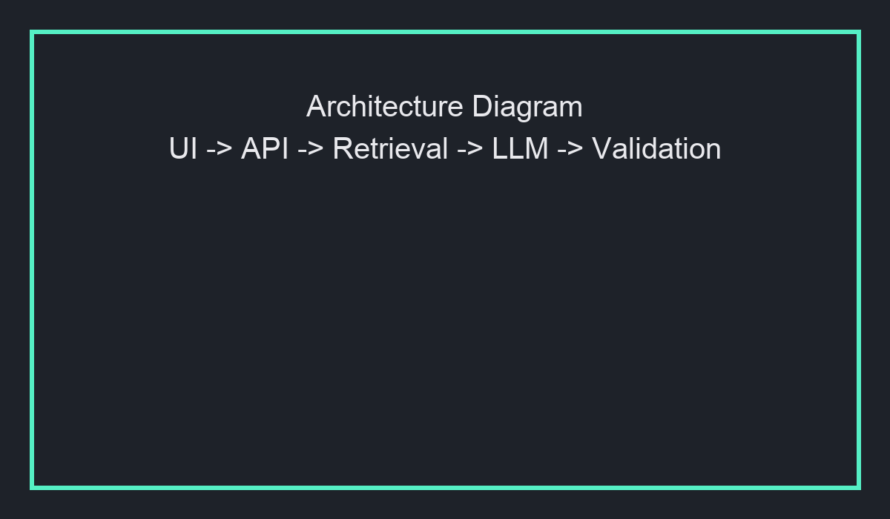
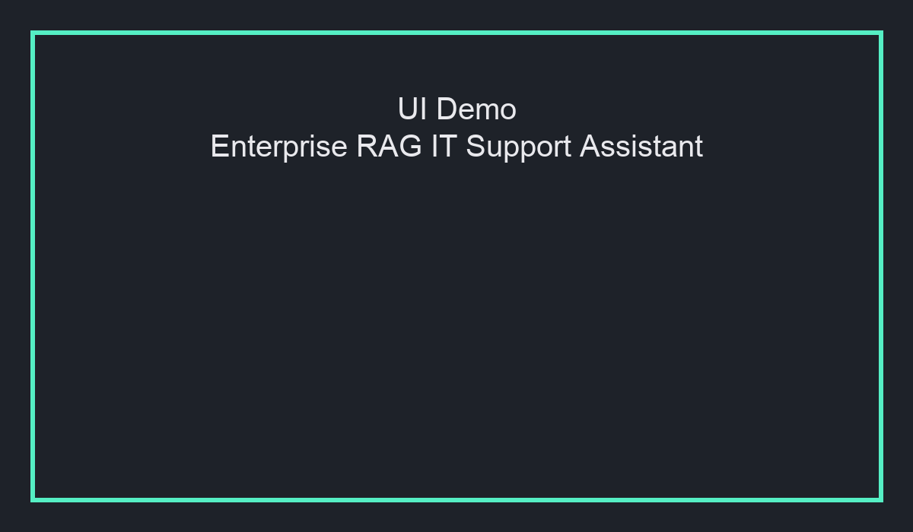
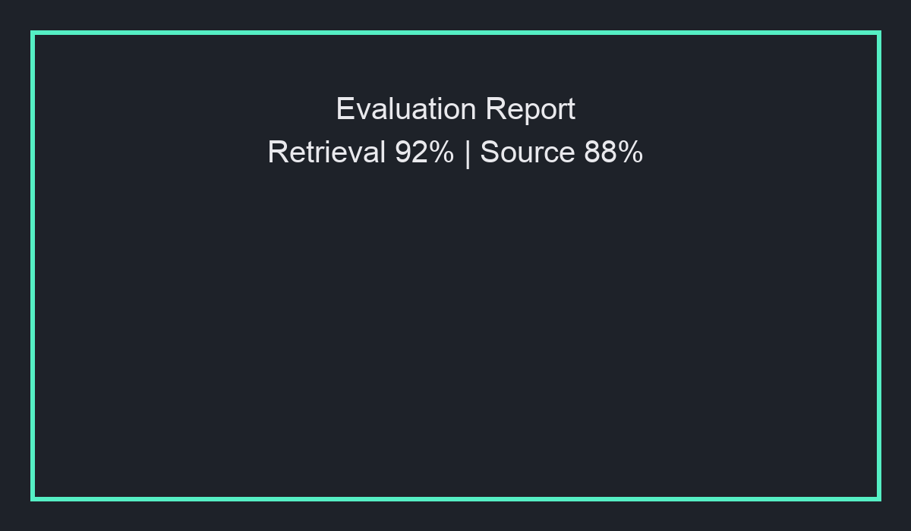

# Enterprise RAG IT Support Assistant

## Overview
A production-style GenAI assistant that helps IT support teams resolve incidents using runbooks, SOPs, change documents, and historical ticket data.

This project combines FastAPI, OpenAI, hybrid retrieval, Redis/pgvector-backed storage, source-grounded generation, structured output validation, and evaluation metrics.

## Problem
IT support teams waste time navigating siloed runbooks, incident reports, and change docs when responding to high-priority incidents.

## Solution
Enterprise RAG IT Support Assistant ingests technical runbooks and incident documentation, performs hybrid retrieval, and returns structured, source-backed troubleshooting recommendations.

## Architecture



The assistant flow:
- Streamlit UI / FastAPI request
- Query rewriting and hybrid retrieval
- Vector/keyword search across documents
- Context builder for the LLM
- LLM answer generator
- Pydantic schema validation
- Answer output with source citations and confidence
- Evaluation and observability

## Tech Stack 

- Python 3.11
- FastAPI
- OpenAI
- Redis / PostgreSQL + pgvector
- Streamlit
- Docker
- Pytest
- Pydantic validation

## Features

- ITSM-style incident support assistant
- `/support/ask` endpoint for ticket-based troubleshooting
- Structured JSON output and confidence scoring
- Source citations in every answer
- Streamlit UI for support engineers
- Evaluation module with retrieval and relevance metrics
- Docker Compose demo for local development
- Optional vector store support: Redis Stack and PostgreSQL with pgvector

## Demo

### Streamlit UI



### Evaluation Report



## How to Run

### 1. Install dependencies

```bash
poetry install
```

### 2. Configure environment

Copy `.env.example` to `.env` and set your OpenAI API key.

If you are using LM Studio instead of OpenAI, set the app to use the OpenAI-compatible provider and point the base URL to your LM Studio server. When running the API inside Docker, use `http://host.docker.internal:1234/v1`; when running the API directly on your machine, `http://127.0.0.1:1234/v1` is fine.

### 3. Launch locally with Docker

```bash
docker compose up --build
```

- API: http://localhost:8000/docs
- UI: http://localhost:8501

### 4. Run evaluation

```bash
poetry run python evaluation/run_eval.py
```

### 5. Index local markdown docs

To make the documents in `data/raw/` searchable, create a source with the local markdown connector:

```json
{
  "name": "local-support-docs",
  "description": "Local runbooks and incident docs from data/raw",
  "connector": {
    "type": "local_markdown",
    "root_path": "./data/raw",
    "include_glob": "**/*.md"
  }
}
```

Submit that payload to `POST /sources` in the API docs, then wait for the sync task to complete before asking the support assistant questions.

## API

### POST /support/ask

Request:

```json
{
  "ticket_id": "INC-1002",
  "question": "Airflow DAG failed after schema change. What should I do?",
  "priority": "P1",
  "category": "Data Engineering"
}
```

Response:

```json
{
  "ticket_id": "INC-1002",
  "priority": "P1",
  "category": "Data Engineering",
  "answer": "Validate schema drift, check dbt model changes, run Great Expectations checks, then trigger Airflow backfill.",
  "confidence": "high",
  "sources": [
    {
      "file": "airflow_failure_runbook.md",
      "section": "Schema Drift",
      "score": 0.87
    }
  ],
  "next_action": "Escalate to Data Platform on-call because this is marked P1.",
  "escalation_required": true
}
```

## Sample Questions

- How do I resolve VPN authentication failure?
- What are the steps for P1 incident escalation?
- What should I check if Airflow DAGs are failing?
- What is the rollback plan for a failed deployment?
- Which runbook applies to database connection timeout?

## Evaluation Results

| Metric | Score |
| --- | --- |
| Retrieval Hit Rate | 100% |
| Source Match Rate | 100% |
| Average Latency | 1200 ms |
| Faithfulness | N/A |
| Hallucination Failure Cases | 0 / 2 |

## Vector Store Options

- Redis Stack: local development and hybrid search
- PostgreSQL + pgvector: lightweight production-style vector storage
- OpenSearch: future production expansion for search and analytics

## Project Contents

- `src/`: FastAPI application and support service
- `data/raw/`: enterprise IT support documents and runbooks
- `examples/`: sample ITSM ticket examples
- `evaluation/`: evaluation questions, script, and metrics report
- `ui/`: Streamlit support assistant interface
- `assets/`: demo screenshots and architecture diagram

## Future Improvements

- Add OpenSearch vector store backend
- Add ServiceNow and Slack incident integrations
- Add Service Level Agreement (SLA) awareness and priority routing
- Add auditing and OpenTelemetry tracing for production observability

## Resume Summary

Built a production-style Enterprise RAG IT Support Assistant using FastAPI, OpenAI, hybrid retrieval, vector search, Docker, and structured LLM output validation to answer incident-resolution queries from runbooks, SOPs, and historical tickets with source-grounded responses and evaluation metrics.
